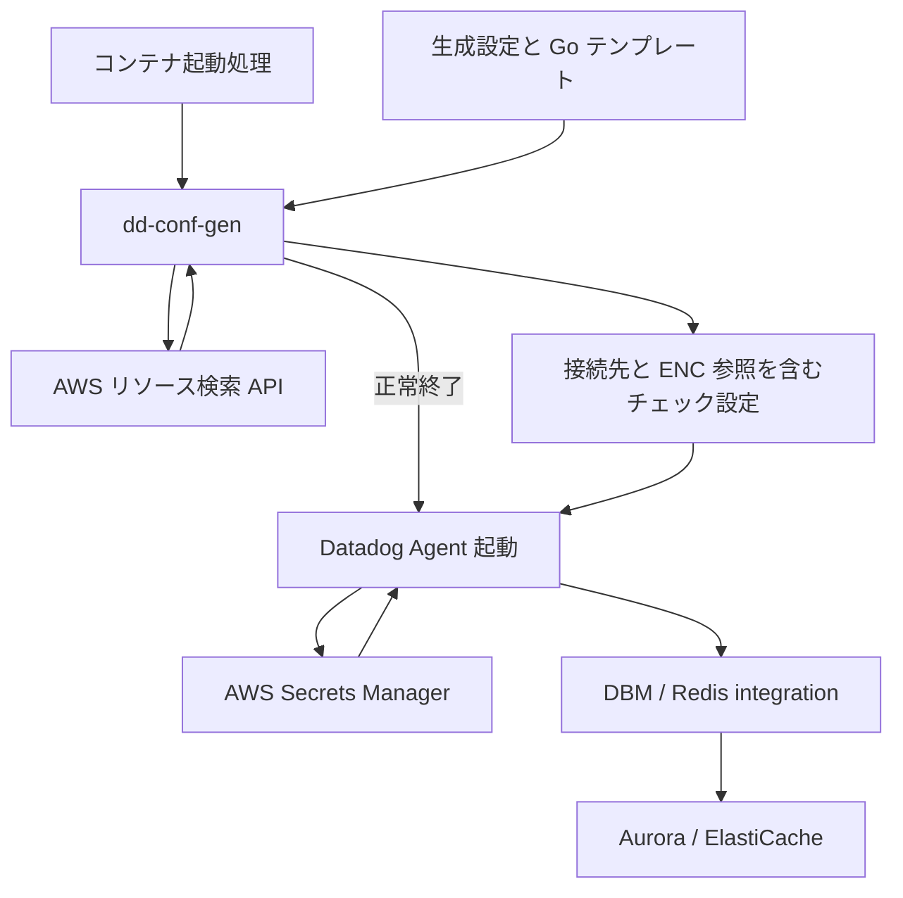

# 設定生成の設計

dd-conf-gen は、ECS 上の Datadog Agent が外部の Aurora MySQL と ElastiCache for Redis へ接続するためのチェック設定を生成する CLI である。DBM と Redis integration による直接接続を前提とする。

## 実行構成

datadog/agent をベースイメージとする独自イメージに、dd-conf-gen、生成設定、Go テンプレートを配置する。コンテナの起動処理は、dd-conf-gen の正常終了後にベースイメージの Agent 起動処理へ制御を渡す。生成失敗時は Agent を起動せず、コンテナを異常終了させる。

起動から監視までの処理と外部アクセスを、以下に示す。

生成するチェック設定は、ノードまたは DB インスタンスの接続先を列挙したファイルである。同じ接続先を Agent 標準の AWS Autodiscovery でも検出してチェックを重複登録しないこと。

## 処理の分担

各構成要素が行う処理を、以下に示す。

| 構成要素 | 処理 |
| --- | --- |
| dd-conf-gen | リソースの検索、タグ条件の判定、接続先とメタデータの取得、テンプレート生成、ファイル保存 |
| Go テンプレート | チェック項目の構成、ロールによる選択、タグ名の変換、条件に応じたシークレット参照名の選択 |
| Datadog Agent | シークレット参照の解決、認証、DBM と Redis integration の実行 |
| コンテナ起動処理・ECS の運用 | 起動順序、生成失敗時の終了、設定変更時のタスク更新、監視対象の割り当て |

シークレット参照名は、値の取得先を指定する文字列である。dd-conf-gen は ENC 構文を解釈せず、テンプレートで生成した文字列をそのまま保存する。シークレットの値の取得、キャッシュ、ローテーション後の再取得は Agent 側で扱う。生成設定にシークレット取得用の項目は設けない。

## 入力と条件判定

生成設定の resources は、リソース種別、リージョン、タグ条件を指定する。outputs は、使用するリソース定義、テンプレート、出力先、検索結果が空の場合の動作を指定する。

認証情報の選択には、タグ条件ごとにリソース定義と出力を分ける方法と、一つのテンプレートでタグやメタデータから参照名を選択する方法を使用する。参照名の選択のために独立したルールエンジンやシークレット検索 API は追加しない。

タグから参照名を構成する場合、対応するタグ値を生成設定の検索条件で限定する。条件と参照先の対応は、生成設定とテンプレートで定義する。条件に一致しないリソースを監視対象に含める必要がある場合は、そのリソースに対応する定義も用意すること。

同じ出力に複数のリソース定義を集約すると、同じホスト名とポート番号のリソースは最初の定義を優先する。認証情報の条件が競合したことを検出する機能ではない。出力間・Agent 間では重複排除しないため、同じ接続先への条件を重複させないこと。

## 検証と失敗の扱い

外部アクセスの前に、全リソースの設定、テンプレートの構文、出力先を検証する。検索と全テンプレートの生成が成功してから保存を開始する。保存はファイル単位の置換であり、複数ファイル全体の更新は不可分ではない。

dd-conf-gen の成功は、設定の生成と保存の成功を意味する。Datadog のチェック設定としての妥当性、ENC 参照先の存在、Agent のシークレット取得権限、DB 接続の成功は保証しない。使用する Agent イメージで設定の読み込みとチェックの実行結果を確認する必要がある。

シークレット取得に失敗する場合は、Agent 側のエラーとして検知する。監視の成否は、コンテナの起動状態に加えて、チェックの実行結果とデータの到着状況で確認する。

## 設定の更新

dd-conf-gen は起動時に一度実行して終了する。リソースの定期検索、設定の自動再読み込み、Agent の再起動、ECS サービスの更新は行わない。

ノード増減、ロール変更、タグ変更、参照するシークレット名の変更を反映するには、生成処理を再実行し、Agent に設定を再適用する必要がある。ECS ではタスク更新による再生成・起動を基本とする。許容する反映遅延に応じてタスクの更新契機を運用で設定する。

同じ参照名のシークレット値だけを更新した場合、dd-conf-gen の再実行は不要である。値の反映には Agent 側の更新または再起動が必要となる。チェック設定ファイルを書き換えるだけで自動的に再読み込みされるとは扱わない。

on_empty: keep はその実行で既存ファイルを保持する指定であり、タスクをまたぐ設定の永続化ではない。生成失敗時に以前の設定で起動するフォールバック機能は持たない。

## AWS 権限

dd-conf-gen が AWS API を呼び出すために必要なのは、各 Provider が使用するリソース検索権限である。Secrets Manager の取得権限は Agent が使用する。

ECS ではコンテナ内の AWS API 呼び出しにタスクロールを使用する。同じタスクで実行する dd-conf-gen と Agent はタスクロールを共有するため、この分担は IAM 権限をプロセス単位に分離するものではない。ECS のタスク実行ロールとは区別する。

タスクロールの詳細は、AWS の [Amazon ECS task IAM role](https://docs.aws.amazon.com/AmazonECS/latest/developerguide/task-iam-roles.html) を参照。

## 設定例

Agent のシークレット設定と条件別の参照方法は、[シークレット参照](secrets.md) を参照。検索条件、ファイル保存、テンプレートデータの仕様は、[生成設定とテンプレート](configuration.md) を参照。
