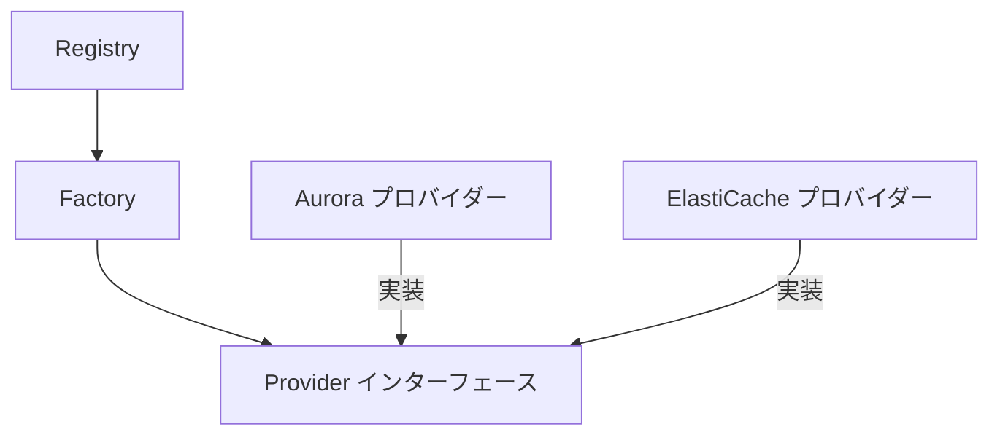
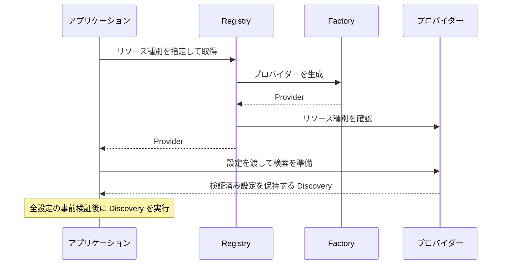

# プロバイダーとレジストリの関係

本ドキュメントは、プロバイダーとレジストリの責務、依存関係、登録と生成の仕組みを説明する。

## 責務の分担

Provider は、リソース種別と検索の準備処理を定義する共通インターフェースである。各プロバイダーはこのインターフェースを実装し、サービス固有の設定検証と検索処理を提供する。

Registry は、リソース種別とプロバイダーの生成関数である Factory の対応を保持する。指定された種別に対応する生成関数を呼び出し、Provider として返す。設定検証や検索の実行は行わない。

アプリケーションは Registry から Provider を取得し、その Provider に検索の準備を依頼する。検索の準備と実行を同じインターフェースで扱えるため、アプリケーションの実行制御にサービス固有の分岐を設ける必要がない。

## 依存関係と登録構成

共通インターフェースと Registry は internal/providers に配置する。具体的なプロバイダーは個別のパッケージに配置し、共通インターフェースに依存する。Registry は具体的なプロバイダーのパッケージに依存しない。

型と実装の依存関係を、以下に示す。矢印は依存する側から依存される側へ向く。

使用するプロバイダーの選択と生成関数の登録は、CLI の起動処理で行う。起動処理が具体的なプロバイダーを参照し、構築した Registry をアプリケーションへ渡す。プロバイダー自身による自動登録や、プロセス全体で共有する可変のレジストリは使用しない。

新しいリソース種別は、Provider を実装するパッケージと、その生成関数の登録を追加して組み込む。Registry 自体の変更は不要である。追加手順の詳細は、[開発](development.md#新しいリソースプロバイダーの追加) を参照。

## 生成と利用の流れ

アプリケーションはリソース定義ごとに、種別を指定してプロバイダーを取得する。Registry は取得のたびに生成関数を呼び出す。標準の登録では、リソース定義ごとに新しいプロバイダーが生成される。

取得から検索までの呼び出し関係を、以下に示す。

Registry は、未登録の種別、nil の生成関数、nil の生成結果、登録キーと生成結果の種別の不一致を取得時にエラーとする。プロバイダーの設定内容の妥当性は、取得後の準備処理で検証する。

プロバイダーの生成と検索の準備では、外部アクセスを行わない。検索はプロバイダーが返した Discovery をアプリケーションが実行するため、Registry は検索時のコンテキストや検索結果を保持しない。

## 登録内容とインスタンスの独立性

Registry は構築時に登録マップをコピーし、構築後に追加や削除する操作を持たない。登録元のマップを変更しても登録内容は変化しない。アプリケーションのテストでは、モックを返す生成関数で専用の Registry を構築し、他のテストの登録内容に影響せずにプロバイダーを置き換えられる。

登録マップのコピーは、生成関数が参照する状態や返すインスタンスを複製しない。生成関数が同じインスタンスを返すこともできるため、Registry だけではプロバイダーの状態の独立性を保証しない。各プロバイダーは、検索の準備時に入力設定から独立した設定を保持する必要がある。

レジストリを並行して参照する場合は、生成関数も並行呼び出しに対応すること。登録内容が不変であることと、生成関数や生成したプロバイダーを並行利用できることは別の性質である。
